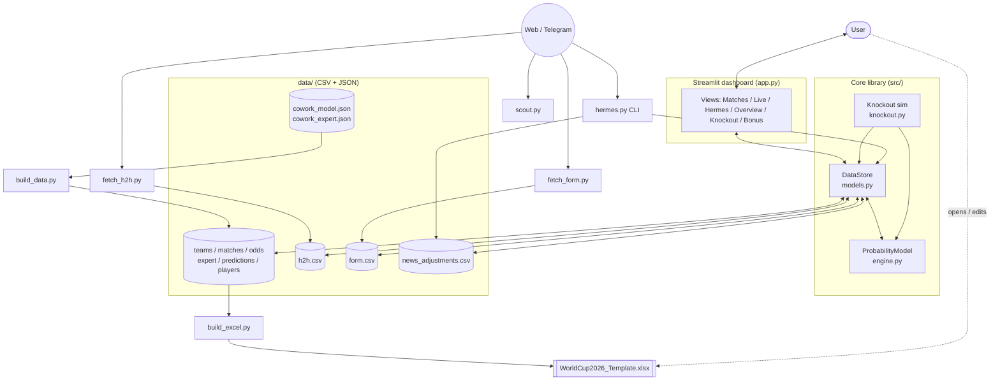

# World Cup 2026 Prediction Workspace

A self-contained workspace to predict the 2026 FIFA World Cup: pre-match
win/draw/loss probabilities, **live** probability updates from the current score
and minute, a Monte-Carlo simulation of the full knockout bracket, and tracking
of how your own predictions are doing. The model is a transparent Dixon-Coles
Poisson built on FIFA ranking points, blended with expert scorelines and nudged
by head-to-head history and recent form.

> The dashboard UI is in **Hebrew (RTL)**; this README and all code are in English.

---

## TL;DR / Quickstart

```bash
pip install -r requirements.txt          # 1. install deps
python build_data.py && python build_excel.py   # 2. build derived data + Excel
streamlit run app.py                      # 3. launch the dashboard (http://localhost:8501)
```

Then open the **"משחק חי" (Live Match)** view, pick a match, set the minute and
score, and watch the win/draw/loss probabilities and your prediction status
update instantly.

---

## Overview / Use Cases

A single Python + Streamlit workspace that turns team ratings and a handful of
CSV files into live, explainable football predictions.

- **Predict** every group-stage match and the full knockout bracket.
- **Live updates** — recompute win/draw/loss probabilities from score + minute.
- **Blend signals** — model + expert scores + head-to-head + recent form + news.
- **Simulate** the whole tournament with Monte-Carlo (qualify → R16 → … → title).
- **Track your bets** — expected points and per-pick status (on track / at risk).
- **Excel mirror** — an `.xlsx` template that reproduces the in-play logic in
  formulas for offline what-if play.

---

## Project Layout

```
WorldCup2026/
├── data/                     # all inputs + derived data (CSV + JSON)
│   ├── groups.csv            # the 12 groups
│   ├── teams.csv             # 48 teams + FIFA points + 0–100 power rating
│   ├── matches.csv           # 72 group fixtures + research scoreline + live state
│   ├── odds.csv              # pre-match 1X2 probabilities (model-derived)
│   ├── expert_scores.csv     # expert scoreline per match (blended into the model)
│   ├── my_predictions.csv    # your predictions (seeded from research)
│   ├── players.csv           # key players + goal/assist share (bonus questions)
│   ├── h2h.csv               # head-to-head past meetings (affects the model)
│   ├── form.csv              # recent-form / momentum per team (affects the model)
│   ├── news_adjustments.csv  # Hermes pre-match updates (injuries / line moves)
│   ├── cowork_model.json     # FIFA points + base ratings from a prior session
│   └── cowork_expert.json    # raw expert scorelines from a prior session
├── src/
│   ├── engine.py             # the probability model (Dixon-Coles on FIFA points)
│   ├── models.py             # DataStore: data layer + update_match_state + Hermes API
│   └── knockout.py           # Monte-Carlo simulation of the whole tournament
├── app.py                    # Streamlit dashboard (Hebrew / RTL)
├── hermes.py                 # CLI bridge for the Hermes agent (news + briefing)
├── scout.py                  # injury / suspension news scout (pre-match)
├── fetch_h2h.py              # refreshes h2h.csv from a live web search
├── fetch_form.py             # refreshes form.csv from a live web search
├── build_data.py             # builds fifa_points, expert_scores.csv, odds.csv, predictions
├── build_excel.py            # builds the Excel template
└── requirements.txt
```

**Major components**

- **`data/`** — the single source of truth. Edit the CSVs, rerun the build
  scripts, and every downstream view updates.
- **`src/engine.py`** — the `ProbabilityModel` and the pure math (goal
  expectations, Dixon-Coles grid, H2H/form supremacy). Swappable.
- **`src/models.py`** — `DataStore`, the high-level object the dashboard, Excel
  mirror, and Hermes all use. Hosts `update_match_state` and the news interface.
- **`src/knockout.py`** — Monte-Carlo of the full tournament on the official
  FIFA 2026 bracket.
- **`app.py`** — the Hebrew/RTL Streamlit dashboard.
- **`hermes.py`, `scout.py`, `fetch_h2h.py`, `fetch_form.py`** — agent-facing
  CLIs for news, scouting, and data refresh.
- **`build_data.py`, `build_excel.py`** — regenerate derived data and the Excel
  template.

---

## Installation

Requires **Python 3.10+**.

```bash
cd WorldCup2026
pip install -r requirements.txt
```

(Optional but recommended: create a virtual environment first with
`python -m venv .venv` and activate it.)

---

## Running the Dashboard

```bash
streamlit run app.py
```

The browser opens at `http://localhost:8501`. The UI is in Hebrew (RTL); the
views are:

- **משחקים (Matches)** — all 72 group games, filter by group, 1X2 probabilities,
  and your pick.
- **משחק חי (Live Match)** — pick a match, enter minute + score, and see the
  updated probabilities and prediction status (🟢 / 🟡 / 🔴) live. "💾 Save"
  writes the state back to `matches.csv`.
- **עדכוני Hermes (Hermes Updates)** — base vs news-adjusted probabilities with a
  recommendation; supports manual entry for testing.
- **סקירת טורניר (Tournament Overview)** — expected points, status breakdown, and
  a Monte-Carlo of your remaining predictions.
- **סימולציית נוקאאוט (Knockout Simulation)** — runs the whole tournament
  thousands of times and shows each team's qualify / R16 / QF / SF / final /
  title odds.
- **בראקט מסומלץ (Simulated Bracket)** — one full random run of the bracket.
- **שאלות בונוס (Bonus Questions)** — model-derived answers to tournament side
  bets.

> Streamlit caches the `DataStore` (`@st.cache_resource`). After editing data
> files or refreshing CSVs, restart the app (or clear the cache) so changes load.

---

## Public API / Core Interfaces

Everything (Streamlit, the CLIs, the Excel builder, the knockout sim) sits on top
of two objects.

**`DataStore`** (`src/models.py`) — load once, then query/mutate:

```python
from src.models import DataStore

ds = DataStore.load("data")

# Live update: persists state and returns all derived probabilities + my status
state = ds.update_match_state("A1", minute=80, home_goals=2, away_goals=1)
# -> dict with p_home/p_draw/p_away, lambdas, status, my_prediction

# Pre-match probabilities (optionally apply active news adjustments)
probs = ds.pre_match_probs("A1", apply_news=False)

# Base vs adjusted briefing + a Hebrew recommendation (what Hermes consumes)
briefing = ds.match_briefing("A1")
```

`update_match_state(match_id, minute, home_goals, away_goals, rating_override=None, use_news=True)`
— `rating_override={"home": <fifa>, "away": <fifa>}` overrides stored ratings for
a single computation; `use_news=True` also applies active news adjustments.

**`ProbabilityModel`** (`src/engine.py`) — the swappable model interface:

- `pre_match(rating_home, rating_away, neutral=False, expert=None, h2h_sup=0.0, form_sup=0.0)`
- `in_play(rating_home, rating_away, minute, home_goals, away_goals, expert=None, h2h_sup=0.0, form_sup=0.0)`

Both return a dict with `p_home`, `p_draw`, `p_away`, and the underlying
`lambda_home` / `lambda_away`.

---

## Data Files and Schemas (`data/`)

### `groups.csv`
| Column | Type | Description |
|--------|------|-------------|
| `group_id` | str | Group letter (A–L) |
| `name_he` | str | Hebrew display name |

### `teams.csv`
| Column | Type | Description |
|--------|------|-------------|
| `team_id` | str | 3-letter team code (e.g. `MEX`) |
| `name_he` / `name_en` | str | Display names |
| `group_id` | str | Group letter |
| `confederation` | str | e.g. CONCACAF, UEFA |
| `group_winner_odds` | int | American odds (legacy/display only) |
| `tier` | int | Seeding tier |
| `power_rating` | float | 0–100 strength proxy (derived from `fifa_points`) |
| `fifa_points` | float | FIFA ranking points — the engine's strength input |

### `matches.csv`
| Column | Type | Description |
|--------|------|-------------|
| `match_id` | str | e.g. `A1` |
| `group_id` | str | Group letter |
| `stage` | str | `group` (knockout slots live in `knockout.py`) |
| `home_id` / `away_id` | str | Team codes |
| `kickoff` | str | Local datetime |
| `venue` | str | Stadium / city |
| `status` | str | `scheduled` / `live` / `finished` |
| `minute` | int | Current minute (live) |
| `home_goals` / `away_goals` | int | Current/final score (blank if unplayed) |
| `doc_pred_home` / `doc_pred_away` | int | Research scoreline |

### `odds.csv`
| Column | Type | Description |
|--------|------|-------------|
| `match_id` | str | Match key |
| `p_home` / `p_draw` / `p_away` | float | Model-derived 1X2 probabilities |

### `expert_scores.csv`
| Column | Type | Description |
|--------|------|-------------|
| `match_id` | str | Match key |
| `expert_home` / `expert_away` | int | Expert scoreline (blended into the model) |

### `my_predictions.csv`
| Column | Type | Description |
|--------|------|-------------|
| `match_id` | str | Match key |
| `pick` | str | `H` / `D` / `A` |
| `pred_home` / `pred_away` | int | Predicted scoreline |
| `confidence` | int | Your confidence |
| `stake` | float | Stake / weight |

### `players.csv`
| Column | Type | Description |
|--------|------|-------------|
| `team_id` | str | Team code |
| `name_he` / `name_en` | str | Player names |
| `role` | str | Position (e.g. FW) |
| `goal_share` | float | Share of team goals (manual estimate) |
| `assist_share` | float | Share of team assists (manual estimate) |

### `h2h.csv`
| Column | Type | Description |
|--------|------|-------------|
| `team_a` / `team_b` | str | The two teams (order-independent) |
| `a_goals` / `b_goals` | int | Score in that meeting |
| `comp` | str | Stage: `friendly` / `group` / `knockout` / `semifinal` / `final` (free text mapped by keyword) |
| `year` | int | Year of the meeting |

### `form.csv`
| Column | Type | Description |
|--------|------|-------------|
| `team_id` | str | Team code |
| `gf` / `ga` | int | Goals for / against (this team's perspective) |
| `comp` | str | Stage label (same vocabulary as `h2h.csv`) |
| `date` | str | `YYYY-MM-DD` (or year) of the match |

### `news_adjustments.csv`
| Column | Type | Description |
|--------|------|-------------|
| `adj_id` | str | Unique id |
| `match_id` | str | Match key |
| `team_id` | str | Affected team |
| `kind` | str | `rating_delta` / `lambda_mult` / `info` |
| `value` | float | Numeric effect |
| `note_he` | str | Hebrew note |
| `source` | str | Source URL/name |
| `created_at` | str | ISO timestamp |
| `active` | int | 1 = active, 0 = cleared |

### JSON sources
- **`cowork_model.json`** — FIFA points / base ratings imported from a prior
  Cowork session; `build_data.py` reads it to populate `fifa_points`.
- **`cowork_expert.json`** — raw expert scorelines; `build_data.py` reads it to
  build `expert_scores.csv`.

---

## Loading Your Own Data

1. Edit the CSV files in `data/` (keep the headers).
2. Rebuild derived data:
   ```bash
   python build_data.py     # fifa_points + power_rating + expert_scores.csv + odds.csv + predictions
   python build_excel.py    # refresh the Excel template
   ```

`build_data.py` pulls FIFA points from `cowork_model.json` and expert scores from
`cowork_expert.json`. To change a team's strength, edit `fifa_points` in
`teams.csv` (or the JSON) and rerun. It **does not overwrite** existing rows in
`my_predictions.csv` — it only fills missing ones.

**Validation.** A typo in a `team_id` (or a dangling `match_id`) otherwise fails
silently and skews predictions. `DataStore.validate()` cross-checks every id
against `teams.csv`/`matches.csv` and returns a list of issues (`[]` when clean):

```python
from src.models import DataStore
issues = DataStore.load("data").validate()
```

The dashboard runs this on every load and shows **✓ נתונים תקינים** or a warning
list in the sidebar, so a bad edit is obvious immediately.

---

## Excel Template

`python build_excel.py` generates **`WorldCup2026_Template.xlsx`** with sheets:
`Teams`, `Matches`, `Odds`, `MyPredictions`, `LiveStatus`.

- **`LiveStatus`** demonstrates the in-play logic in formulas — change the minute
  or score and the status flag updates (a time-weighted approximation of the
  Poisson engine). The `Teams` sheet includes an American-odds → probability
  conversion.
- The Excel file mirrors the Python model **approximately**; the Python engine in
  `src/engine.py` remains the source of truth.

---

## Probability Model

**In plain English:** each team's strength is its FIFA ranking points (a neutral
~1400–1900 scale). A Dixon-Coles Poisson model turns the rating gap into expected
goals for each side, then into a win/draw/loss grid. The model is blended with an
expert scoreline, and finally nudged by two small, capped signals: **head-to-head
history** and **recent form**.

**The detail** (`src/engine.py`):

1. **Team strength** = FIFA ranking points (mean ≈ 1500). Neutral, unlike
   group-winner odds (which conflate strength with how easy a group is).
2. **Pre-match goals:**
   ```
   sup    = (rating_home - rating_away) / K        (+ home advantage, + h2h, + form)
   total  = BASE_TOTAL + |r_h + r_a - 2*FIFA_MEAN| / 4000
   λ_home = max(MIN_LAMBDA, (total + sup) / 2)
   λ_away = max(MIN_LAMBDA, (total - sup) / 2)
   ```
   The 1X2 grid applies a **Dixon-Coles low-score correction** (`DC_RHO = -0.06`)
   so 0-0 / 1-0 / 0-1 / 1-1 are dependent rather than independent.
3. **Expert blend:** λ is pulled toward the expert scoreline (`EXPERT_W = 0.55`
   on the model, 0.45 on the expert).
4. **Head-to-head (`h2h.csv`):** a small bounded supremacy bump. Each past
   meeting is **weighted by stage** (`H2H_COMP_WEIGHTS`: friendly 0.40, group
   1.00, knockout 1.25, semifinal 1.40, final 1.50), **decays with age**
   (6-year half-life), and **shrinks toward 0 for small samples**. Capped at
   **±0.50 goals** (`H2H_CAP`). **Two teams that never met contribute exactly 0.**
   Applied at neutral venues too — history travels with the matchup.
5. **Recent form / momentum (`form.csv`):** how a team is *arriving*. Each recent
   match scores a result point (+1 / 0 / −1) plus a capped goal-margin term
   (`FORM_GD_COEF`, clamped at ±3 so a 7-0 ≈ a 3-0), **stage-weighted**
   (`FORM_COMP_WEIGHTS`: friendly 0.60 — milder than H2H, since pre-tournament
   games are mostly friendlies — competitive 1.00, knockout 1.15+), **decaying**
   (180-day half-life) and **shrunk** for small samples. The **difference**
   between the two teams' form scores nudges supremacy, capped at **±0.35 goals**
   (`FORM_CAP`). **A team with no recent matches scores exactly 0**, and two teams
   with equal form cancel — momentum only ever tilts toward whoever arrives hotter.
6. **In-play:** only the *remaining* share of each λ applies (scaled by minutes
   left), added to the current score; recomputed as independent Poisson (the
   Dixon-Coles correction is a full-match calibration).

**Assumptions (documented so you can challenge them):**
- 90 minutes of regular time; stoppage time ignored.
- Home advantage is a flat supremacy bump (`HOME_SUP`); `neutral=True` drops it.
- No explicit red-card modeling.

**Replacing the model:** swap the `ProbabilityModel` class in `src/engine.py` for
any implementation exposing the same `pre_match` / `in_play` interface — every
caller works through it unchanged.

---

## Hermes Integration and News Updates

**Hermes** is an external agent (runs in Telegram) that scrapes the web — betting
sites, sports news, FIFA announcements — and pushes pre-match updates **into**
this workspace, then pulls a briefing to decide whether to alert you. The
contract is a JSON-over-stdout CLI (`hermes.py`); adjustments land in
`data/news_adjustments.csv`, which the dashboard and engine read on the next
refresh.

```bash
# Brazil loses a key player before C1 — knock 60 FIFA points off Brazil:
python hermes.py update --match C1 --team BRA --kind rating_delta --value -60 \
    --note "ברזיל מאבדת שחקן מפתח" --source "espn.com"

# Pull the briefing (base vs adjusted probabilities + Hebrew recommendation):
python hermes.py briefing --match C1

# List / clear adjustments:
python hermes.py list --match C1
python hermes.py clear --id <adj_id>

# Permanent pre-tournament rating refresh (new ranking / long-term injury):
python hermes.py rate --team BRA --value 1730   # absolute
python hermes.py rate --team ARG --delta -120   # relative
```

**`update` vs `rate`:**
- **`update`** — a single-match, live adjustment that does **not** change the
  team's base strength. Kinds: `rating_delta` (FIFA-point delta), `lambda_mult`
  (multiplier on expected goals), `info` (note only).
- **`rate`** — a **permanent** change to `fifa_points` in `teams.csv` (and
  recomputed `power_rating`), so every model (groups, knockout, bonus) uses the
  new strength.

Any command that writes (`--write`, `update`, `rate`, `clear`) updates the CSVs;
Streamlit and the engine pick up the change on the next run/refresh.

---

## Automated Data Refresh (`fetch_h2h.py`, `fetch_form.py`)

Two scrapers (modeled on `scout.py`) refresh the H2H and form signals from a live
open web search (DuckDuckGo lite). Both follow a **recommend-don't-apply**
philosophy: they print proposed rows and only write when you pass `--write`.

**`fetch_h2h.py`** — recent meetings *between* two teams; classifies
friendly/competitive, recency-filters, merges into `h2h.csv`:

```bash
python fetch_h2h.py                 # propose for all group pairs (dry run)
python fetch_h2h.py --pair ENG CRO  # one pair
python fetch_h2h.py --write         # fetch + merge into h2h.csv
python hermes.py h2h --pair ENG CRO --write   # same, via Hermes
```

**`fetch_form.py`** — recent results for a *single* team; merges into `form.csv`:

```bash
python fetch_form.py                # propose for all teams (dry run)
python fetch_form.py --team MEX     # one team
python fetch_form.py --write        # fetch + merge into form.csv
python hermes.py form --team MEX --write      # same, via Hermes
```

**Rate limiting:** DuckDuckGo throttles bursts, so a full sweep of all pairs/teams
may be partially blocked (expected — the script reports how many loaded and skips
blocked ones gracefully). **Recommended usage is per-pair / per-team** (a single
request) right before a fixture. Both scripts use a real browser User-Agent and
retry with backoff; no proxy configuration is required.

---

## Knockout Simulation

`src/knockout.py` runs a Monte-Carlo of the entire tournament:

1. **Group stage** — each game with `status=finished` in `matches.csv` is locked
   to its real result; the rest is sampled from the model. Standings rank by
   points → goal difference → goals for.
2. **Qualifiers** — 12 group winners + 12 runners-up + the 8 best third-placed
   teams.
3. **Bracket** — the **official FIFA 2026 bracket** (matches M73–M104). Third-place
   slots use the official Annex-C candidate lists, assigned by constrained
   bipartite matching (no same-group rematch). The R16/QF/SF tree is wired by
   explicit match dependencies.
4. **Knockout games** — neutral venue; draws resolve (ET/penalties) by relative
   strength, but the favourite's advance probability is **capped at
   `SHOOTOUT_CAP = 0.58`** — a shootout is close to a coin flip regardless of the
   skill gap, so even a huge favourite is at most ~58% to survive, not 80%+.
   H2H and form supremacy are precomputed once per run and applied throughout.

```python
from src.models import DataStore
from src import knockout

ds = DataStore.load("data")
df = knockout.run(ds, n=2000, seed=42)
# df: one row per team with qualify_% / r16_% / qf_% / sf_% / final_% / title_%

# One full random bracket (scores + winners) instead of probabilities:
bracket = knockout.simulate_detail(ds, seed=42)
```

> `knockout.py` is a library module (no standalone CLI). Call `knockout.run` /
> `knockout.simulate_detail` from Python, or use the dashboard's simulation views.

---

## Model Reliability / Backtesting

A prediction model is only trustworthy once it is scored against *known*
results. `src/backtest.py` runs the **exact same `ProbabilityModel`**
retrospectively over the **2022 World Cup** (`data/backtest_2022.csv` — 64 real
matches with October-2022 FIFA points; the whole tournament was at neutral
venues, so this isolates pure strength prediction with no home-advantage
confound). Penalty-shootout knockouts are recorded as their 90'/120' draw, since
the model predicts the regulation outcome, not the shootout.

It reports standard forecasting metrics and compares them to naive baselines so
the numbers have context:

| Metric | Meaning | Better |
|--------|---------|--------|
| **Brier score** | Mean squared error of the H/D/A probability vector | Lower (0 = perfect, 0.667 = always-uniform) |
| **Log loss** | Penalises confident wrong calls harshly | Lower |
| **Accuracy** | Share where the model's favourite was the result | Higher |
| **Calibration** | When it says "60%", does it happen ~60%? | Gap → 0 |

```bash
python -m src.backtest          # human-readable report
python -m src.backtest --json   # structured output
```

```python
from src import backtest
rep = backtest.run()                       # full report dict
m   = backtest.evaluate(backtest.load())   # Metrics(brier, log_loss, accuracy, ...)
backtest.sweep(backtest.load(), "K", [180, 200, 220])   # tune a constant by measurement
```

On the shipped 2022 data the model scores **Brier ≈ 0.587 / Log-loss ≈ 1.009**,
about **+12%** better than blind 1/3 guessing and **+8%** better than knowing
only the base rate — i.e. it has genuine, measured skill, not just plausible
output. The `K` sweep confirms the current `K = 200` is near-optimal (best Brier
sits at `K ≈ 180–200`). The dashboard exposes all of this under the **"אמינות
המודל"** (Model Reliability) view, including the calibration curve.

### FIFA vs Elo (CR recommendation, measured)

The review's top suggestion was to blend Elo into the strength input. Rather than
assume it helps, `backtest.elo_sweep` measures it: `data/backtest_2022.csv`
carries Elo columns (Nov-2022 eloratings.net, approximate) and the engine can
z-score-blend FIFA + Elo (`engine.blend_strength`, weight `engine.ELO_WEIGHT`).

Result on 2022: a FIFA/Elo blend at `w ≈ 0.4` gives the best Brier (≈ 0.586 vs
0.587 pure FIFA) and one extra correct match — a **marginal, ~0.3% improvement**
that does not improve log-loss, on a single 64-match tournament with approximate
Elo. That is too weak to justify changing the default (the same anti-overfit
discipline applied to `K`), so **`ELO_WEIGHT` ships at `0.0` (pure FIFA)**. The
full capability is wired and gated: add an `elo_points` column to `teams.csv` and
raise `engine.ELO_WEIGHT` to enable the blend in production — no code change
needed. Revisit with verified, multi-tournament Elo data.

To validate a different tournament, drop a CSV with the same schema (`date, home,
away, rating_home, rating_away, home_goals, away_goals, neutral, stage`) and pass
`--csv path` (or `backtest.run("path")`).

---

## UI Status Icons

| Icon | Meaning |
|------|---------|
| 🟢 | Prediction currently on track (`ON_TRACK`) |
| 🟡 | Prediction at risk (`AT_RISK`) |
| 🔴 | Prediction very unlikely / almost dead (`ALMOST_DEAD`) |
| ✅ | Finished — prediction was correct |
| ❌ | Finished — prediction was wrong |

---

## Architecture & Data Flow



---

## Tests

Lightweight self-checking scripts live in `tests/` and can be run directly:

```bash
python tests/test_h2h.py       # head-to-head signal + agent path
python tests/test_form.py      # momentum / recent-form signal + agent path
python tests/test_backtest.py  # backtest metrics, calibration, 2022 skill check
python tests/test_integrity.py # shootout cap + schema validation
python tests/test_elo.py       # FIFA/Elo blend + production gate
```

Each prints PASS/FAIL per check and asserts on failure (also runnable under
`pytest` if installed).

---

## Disclaimer

> This project is for **educational and entertainment purposes only**.
> It is **not** betting or financial advice.
